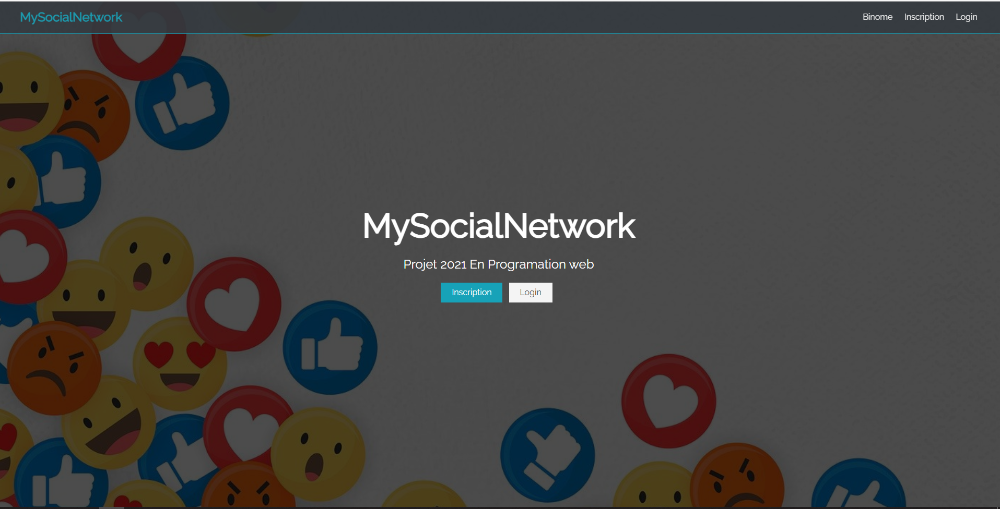
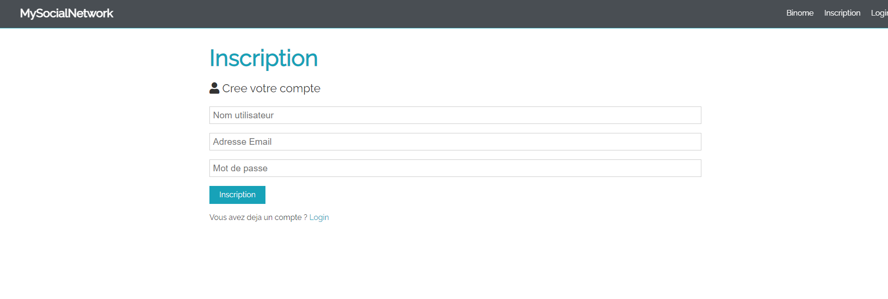

# mysocialnetwork
This is a fully working social network website with many functionnalities : 
-Authentification 
-Editing profile (Profile Picture / Bio / Personal Information ) 
-Upload Posts 
-Interacting with posts (Like/Comment) 
-Sending Friend Requests 
-Search for people by their username or posts  
-Choose who can look at your posts 

 
You must import network.sql to your database for the project to work
